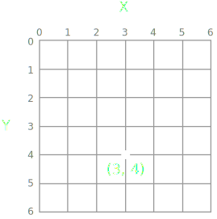
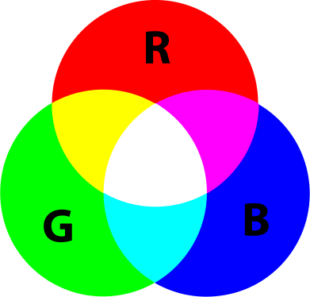
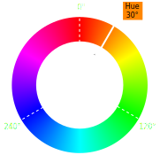
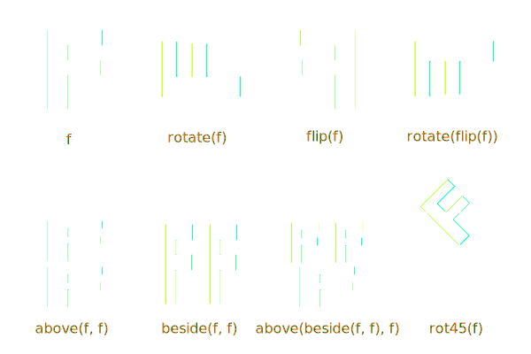

% Drawing with code from interactive graphics to generative art
% Paweł Widera
% 2015-01-14

# Introduction

## What is this about?

- making **pretty graphics** with code
- **interacting** with the drawings
-  
- generating cool art with 
  **composition** and **procedural animation**

## Tutorial organisation

No need to type, just **download code** and play with it :) 
Links are on the **slides**, follow them here:

<h1>
[http://tinyurl.com/pyne-genart](http://tinyurl.com/pyne-genart)
</h1>

Please don't afraid to **ask questions**!

The **dojo** part will be about generating your own **piece of art**.

## Processing and friends

[processing][processing] 
Java application that is an environment for creating visuals. 
Straightforward language with easy API.

[processing.js][processingjs] 
Processing interpreter written in Javascript rendering to canvas.

[pyprocessing][pyprocessing] 
Port of processing API - not the language. 
Built on OpenGL gaming library [pyglet][pyglet].

	sudo pip install https://pyprocessing.googlecode.com/files/pyprocessing-0.1.3.22.tar.gz

## Screen coordinates

<figure></figure>

## Colours - RGB model

- hardware-oriented
- based on colour mixing
- not intuitive
-  
- **color(255, 168, 0)**

## Colours - HSB model

- hue
- saturation
- brightness
-  
- **color(30, 100, 100)**

# First steps

## Shapes

<a href="../code/shapes.py">code</a>

~~~ {.python}
import pyprocessing as p

p.size(400, 500)  # screen width and height

# body
p.triangle(100, 410, 200, 200, 300, 410)  # 3 points (x,y)

# hands
p.ellipse(100, 300, 40, 40)  # centre point (x,y)
p.ellipse(300, 300, 40, 40)  # and size (width,height)

# face
p.ellipse(200, 180, 190, 200)

# mouth
p.line(183, 246, 245, 230)  # 2 points (x,y)

# frames
p.line(107, 163, 295, 163)

# lenses
p.rect(132, 150, 50, 40)  # top left corner (x,y)
p.rect(215, 150, 50, 40)  # and size (width,height)

p.run()
~~~

## Fill and stroke

<a href="../code/colours.py">code</a>

~~~ {.python}
import pyprocessing as p

p.size(400, 500)
p.colorMode(p.HSB, 360, 100, 100, 100)
p.background(0, 0, 0)  # HSB

p.fill(120, 50, 50)  # HSB
p.triangle(100, 410, 200, 200, 300, 410)

p.fill(40, 50, 100)  # HSB
p.ellipse(100, 300, 40, 40)
p.ellipse(300, 300, 40, 40)

p.ellipse(200, 180, 190, 200)

p.stroke(10, 100, 75)  # HSB
p.strokeWeight(10)
p.line(183, 246, 245, 230)

p.stroke(100, 50, 100)  # HSB
p.line(107, 163, 295, 163)

p.fill(230, 50, 100, 50)  # HSB + alpha
p.rect(132, 150, 50, 40)
p.rect(215, 150, 50, 40)

p.run()
~~~

## Events

<a href="../code/events.py">code</a>

~~~ {.python}
import pyprocessing as p

p.size(400, 400)

def mouseDragged():
	# draw a line between previous and current mouse position
	p.line(p.pmouse.x, p.pmouse.y, p.mouse.x, p.mouse.y)

def keyPressed():
	# clear the screen
	if p.key.char in 'cC':
		p.background(200)

p.run()
~~~

[pyprocessing quick reference][reference]

## Interaction

<a href="../code/mouse.py">code</a>

~~~ {.python}
import pyprocessing as p

def setup():
	p.size(400, 400)
	p.rectMode(p.CENTER)
	p.noStroke()

def draw():
	p.background(50)  # grey scale
	p.fill(255, 150)  # grey scale + alpha

	size = p.mouse.y / 2
	p.rect(p.mouse.x, 200, size + 10, size + 10)
	p.rect(400 - p.mouse.x, 200, 210 - size, 210 - size)

p.run()
~~~

# Geometry

## Pixel by pixel

<a href="../code/pattern.py">code</a>

~~~ {.python}
import pyprocessing as p

p.size(255, 255)

for x in range(256):
	for y in range(256):
		colour = x ^ y
		p.stroke(colour)
		p.point(x, y)

p.run()

"""
^ is bitwise exclusive or (xor)

0 ^ 0 = 1 ^ 1 = 0
1 ^ 0 = 0 ^ 1 = 1

Example: 100101 ^ 101001 = 001100

"""
~~~

## Transformations

<a href="../code/star.py">code</a>

~~~ {.python}
import math
import pyprocessing as p

p.size(400, 400)
p.colorMode(p.HSB, 360, 100, 100, 100)
p.noStroke()

p.background(0)
p.fill(0, 100, 100, 40)

# shift the (0, 0) point
p.translate(200, 200)

for i in range(10):
	# rotate around (0, 0) by 1/10th of a full angle
	p.rotate(2 * math.pi / 10)
	p.triangle(0, -200, 100, 100, -100, 100)

p.run()
~~~

## Rings - setup

<a href="../code/rings-1.py">code</a>

~~~ {.python}
import math
import random
import pyprocessing as p

COLOURS = [(45,25,100), (345,50,65), (10,60,90), (30,50,100)]

p.size (600, 200)
p.colorMode(p.HSB, 360, 100, 100)
p.noStroke()
p.background(292, 40, 30)

x = random.randint(200, 400)
y = random.randint(5, 150)
n = random.randint(3, 30)
radius = random.randint(10, 100)
size = random.randint(3, 15)
colour = random.choice(COLOURS)

p.fill(*colour)
for i in range(n):
	angle = i * 2*math.pi / n
	new_x = x + math.cos(angle) * radius
	new_y = y + math.sin(angle) * radius
	p.ellipse(new_x, new_y, size, size)

p.run()
~~~

## Rings - loop

<a href="../code/rings-2.py">code</a>

~~~ {.python}
def rings():
	p.background(292, 40, 30)

	for i in range(30):
		x = random.randint(0, 600)
		y = random.randint(0, 200)
		...

def keyPressed():
	rings()

rings()
p.run()
~~~

## Recursion

<a href="../code/recursion.py">code</a>

~~~ {.python}
import pyprocessing as p

p.size(400, 400)
p.noStroke()

def circle(x, radius, level):
	p.fill(126 * level / 4)
	p.ellipse(x, 200, radius * 2, radius * 2)

	if level > 1:
		circle(x - 0.5 * radius, 0.5 * radius, level - 1)
		circle(x + 0.5 * radius, 0.5 * radius, level - 1)

circle(200, 200, 6)

p.run()
~~~

## Tree - setup

<a href="../code/tree-1.py">code</a>

~~~ {.python}
import pyprocessing as p

def setup():
	p.size(400, 400)

def draw():
	# draw tree trunk and move to its top
	p.translate(200, 400)
	p.line(0, 0, 0, -120)
	p.translate(0, -120)

	# draw the branches
	branches(120)

def branches(height):
	height *= 0.66

	# draw left and right branch
	for angle in [-0.5, 0.5]:
		p.pushMatrix()
		p.rotate(angle)
		p.line(0, 0, 0, -height)
		p.translate(0, -height)
		p.popMatrix()

p.run()
~~~

## Tree - recursion

<a href="../code/tree-2.py">code</a>

~~~ {.python}
def branches(height):
	height *= 0.66

	# finish branching when height is small
	if height < 3:
		return

	# draw left and right branch
	for angle in [-0.5, 0.5]:
		p.pushMatrix()
		p.rotate(angle)
		p.line(0, 0, 0, -height)
		p.translate(0, -height)
		branches(height)  # <-- RECURSION
		p.popMatrix()
~~~

## Tree - interaction

<a href="../code/tree-3.py">code</a>

~~~ {.python}
def draw():
	...
	angle = math.pi * p.mouse.x / 800

	# draw the branches
	branches(120, angle)

def branches(height, angle):
	...
	# draw left and right branch
	for angle in [-angle, angle]:
		...
		branches(height, angle)
		...
~~~

# Composition

## **Square Limit** by M.C. Escher

<h1>
[download image](../code/fish.png)
</h1>

["Functional geometry" by Peter Henderson][functional_geometry]

## Functions

<figure></figure>

## Functions - **rotation**

<a href="../code/square_limit-1.py">code</a>

~~~ {.python}
import math
import pyprocessing as p

p.size(800, 800)
p.background(255)
p.translate(300, 300)
img = p.loadImage("fish.png")

def fish():
	p.image(img, -80, -80)

def rotate(f):
	def wrapped_f():
		p.pushMatrix()
		p.translate(0, 240)
		p.rotate(-math.pi / 2)
		f()
		p.popMatrix()

	return wrapped_f

fish()

composition = rotate(rotate(fish))
composition()

p.run()
~~~

## Functions - **flip**

<a href="../code/square_limit-2.py">code</a>

~~~ {.python}
def flip(f):
	def wrapped_f():
		p.pushMatrix()
		p.translate(240, 0)
		p.scale(-1, 1)
		f()
		p.popMatrix()
	return wrapped_f

fish()

composition = flip(fish)
composition()
~~~

## Functions - refactoring

<a href="../code/square_limit-3.py">code</a>

~~~ {.python}
def transform(t, *args):
	def wrapper(*args):
		def wrapped_f():
			p.pushMatrix()
			t(*args)  # perform transformation t
			args[-1]()  # call function f
			p.popMatrix()
		return wrapped_f
	return wrapper

@transform
def rotate(f):
	p.translate(0, 240)
	p.rotate(-math.pi / 2)

@transform
def flip(f):
	p.translate(240, 0)
	p.scale(-1, 1)
~~~

## Functions - **rot45**

<a href="../code/square_limit-4.py">code</a>

~~~ {.python}
@transform
def rot45(f):
	p.rotate(-math.pi / 4)
	p.scale(1 / math.sqrt(2))

fish()

composition = flip(rot45(fish))
composition()
~~~

## Building tiles - **overlay**

<a href="../code/square_limit-5.py">code</a>

~~~ {.python}
def overlay(*args):
	def wrapped_f():
		for f in args:
			f()
	return wrapped_f

fish2 = flip(rot45(fish))
fish3 = rotate(rotate(rotate(fish2)))

t = overlay(fish, fish2, fish3)
u = overlay(fish2, rotate(fish2), rotate(rotate(fish2)), rotate(rotate(rotate(fish2))))

t()
~~~

## Functions - **above** and **beside**

<a href="../code/square_limit-6.py">code</a>

~~~ {.python}
@transform
def above(f, g):
	p.scale(1, 0.5)
	f()
	p.translate(0, 240)

@transform
def beside(f, g):
	p.scale(0.5, 1)
	f()
	p.translate(240, 0)

...

def grid2x2(a, b, c, d):
	return above(beside(a, b), beside(c, d))

composition = grid2x2(u, u, u, u)
composition()
~~~

## Building tiles - **side**

<a href="../code/square_limit-7.py">code</a>

~~~ {.python}
def blank():
	pass

def side(n):
	if n < 2:
		return grid2x2(blank, blank, rotate(t), t)
	return grid2x2(side(n - 1), side(n - 1), rotate(t), t)

composition = side(2)
composition()
~~~

## Building tiles - **corner**

<a href="../code/square_limit-8.py">code</a>

~~~ {.python}
def corner(n):
	if n < 2:
		return grid2x2(blank, blank, blank, u)
	return grid2x2(corner(n - 1), side(n -1), rotate(side(n - 1)), u)

composition = corner(2)
composition()
~~~

## All together now

<a href="../code/square_limit-9.py">code</a>

~~~ {.python}
@transform
def above(*args):
	scale = 1.0 / len(args)
	p.scale(1, scale)
	for f in args[:-1]:
		f()
		p.translate(0, 240)

@transform
def beside(*args):
	scale = 1.0 / len(args)
	p.scale(scale, 1)
	for f in args[:-1]:
		f()
		p.translate(240, 0)
...

def grid3x3(a, b, c, d, e, f, g, h, i):
	return above(beside(a, b, c), beside(d, e, f), beside(g, h, i))

def square(n):
	return grid3x3(
		corner(n), side(n), rotate(rotate(rotate(corner(n)))),
		rotate(side(n)), u, rotate(rotate(rotate(side(n)))),
		rotate(corner(n)), rotate(rotate(side(n))), rotate(rotate(corner(n)))
	)

composition = square(3)
composition()
~~~

# Animation

## Simple movement - setup

<a href="../code/wave-1.py">code</a>

~~~ {.python}
import math
import pyprocessing as p

def setup():
	p.size(400, 400)
	p.colorMode(p.HSB, 360, 100, 100)
	p.fill(30, 100, 100)
	p.noStroke()
	p.noLoop()

def draw():
	p.background(0)

	for i in range(20):
		angle = i * 0.2
		x = i * 20
		y = (math.sin(angle) + 1) * 200
		p.ellipse(x, y, 16, 16)

p.run()
~~~

## Simple movement - animation

<a href="../code/wave-2.py">code</a>

~~~ {.python}
SPEED = 0.02

...

def setup():
	#p.noLoop()  # <-- LOOPING ENABLED

...

def draw():
	...
	angle = i * 0.2 + p.frame.count * SPEED
	...
~~~

## Rings - object to animate

~~~ {.python}
class Ring:
	def __init__(self, x, y):
		self.x = x
		self.y = y
		self.n = random.randint(3, 30)
		self.radius = random.randint(10, 100)
		self.size = random.randint(3, 15)
		self.colour = random.choice(COLOURS)

		self.angle = random.random() * 2*math.pi
		self.speed = p.map(self.radius, 10, 100, 0.03, 0.01)

		# randomise direction of rotation
		if random.random() > 0.5:
			self.speed *= -1

	def draw(self):
		p.fill(*self.colour)
		for i in range(self.n):
			angle = i * 2*math.pi / self.n + self.angle
			new_x = self.x + math.cos(angle) * self.radius
			new_y = self.y + math.sin(angle) * self.radius
			p.ellipse(new_x, new_y, self.size, self.size)

		self.angle += self.speed
~~~

## Rings - animation

<a href="../code/rings_animated.py">code</a>

~~~ {.python}
import math
import random
import pyprocessing as p

rings = []

def setup():
	p.size (600, 200)
	p.colorMode(p.HSB, 360, 100, 100)
	p.noStroke()
	add(random.randint(0, 600), random.randint(0, 200))

def draw():
	p.background(292, 40, 30)
	for ring in rings:
		ring.draw()

def add(x, y):
	for i in range(10):
		ring = Ring(x, y)
		rings.append(ring)

def mousePressed():
	if p.mouse.button == p.LEFT:
		add(p.mouse.x, p.mouse.y)
	else:
		for i in range(10):
			rings.pop()

p.run()
~~~

## Animation without movement

<a href="../code/dark_light.py">code</a>

~~~ {.python}
import pyprocessing as p

MAX_DISTANCE = p.dist(0, 0, 640, 360)

def setup():
	p.size(640, 360)
	p.noStroke()

def draw():
	p.background(0)

	for i in range(width / 20 + 1):
		for j in range(height / 20 + 1):
			size = p.dist(p.mouse.x, p.mouse.y, i * 20, j * 20)
			size = size / MAX_DISTANCE * 66
			p.ellipse(i * 20, j * 20, size, size)

p.run()
~~~

## Relative movement

<a href="../code/follow.py">code</a>

~~~ {.python}
import math
import pyprocessing as p

x = [0] * SIZE
y = [0] * SIZE

def setup():
	p.size(400, 400)
	p.strokeWeight(10)
	p.stroke(255, 200)

def draw():
	p.background(0)
	drag_segment(0, p.mouse.x, p.mouse.y)
	for i in range(SIZE - 1):
		drag_segment(i + 1, x[i], y[i])

def drag_segment(i, xin, yin):
	# find the inclination of a segment with respect to X axis
	angle = math.atan2(yin - y[i], xin - x[i])
	x[i] = xin - math.cos(angle) * LENGTH
	y[i] = yin - math.sin(angle) * LENGTH

	p.pushMatrix()
	p.translate(x[i], y[i])
	p.rotate(angle)
	p.line(0, 0, LENGTH, 0)
	p.popMatrix()

p.run()
~~~

# Emergent Art

## **Process Compendium** by Casey Reas

~~~ {.python}
# FORMS
F1 = "circle"
F2 = "line"

# BEHAVIOURS
B1 = "move in a straight line"
B2 = "constrain to surface"
B3 = "change direction while touching another element"
B4 = "move away from an overlapping element"
B5 = "enter from the opposite edge after moving off the surface"
B6 = "orient toward the direction of an element that is touching"
B7 = "deviate from the current direction"

# ELEMENTS
E1 = F1 + B1 + B2 + B3 + B4
E2 = F1 + B1 + B5
E3 = F2 + B1 + B3 + B5
E4 = F1 + B1 + B2 + B3
E5 = F2 + B1 + B5 + B6 + B7
~~~

**Element** is a little machine with **form** and a set of **behaviours**.
How releations between elements are visualised is defined by a **process**.

## Process 4

**( 1 )** Fill a rectangular surface with varying sizes of **Element 1**.

**( 2 )** Draw a line from the **centres** of elements that are **touching**.

**( 3 )** Set the **colour** of the shortest possible line to **black** and the longest
to **white**, with varying **greys** representing values in between.

## Process 4 - setup

<a href="../code/process4-1.py">code</a>

~~~ {.python}
import math
import random
import pyprocessing as p

SIZE = 400 # screen size
SCALE = 3  # number of elements

class Element:
	def __init__(self):
		self.x = random.randrange(int(0.25 * SIZE), int(0.75 * SIZE))
		self.y = random.randrange(int(0.25 * SIZE), int(0.75 * SIZE))
		self.radius = random.randrange(5, int(0.2 * SIZE))

elements = [Element() for i in range(SCALE)]

def setup():
	p.size(SIZE, SIZE)
	p.noFill()
	p.stroke(255)

def draw():
	p.background(0)
	for e in elements:
		p.ellipse(e.x, e.y, e.radius, e.radius)

p.run()
~~~

## Process 4 - **Behaviour 1**

<a href="../code/process4-2.py">code</a>

~~~ {.python}
class Element:
	def __init__(self):
		...
		# random angle in radians
		self.angle = random.random() * 2 * math.pi
		# rotate a unit vector by angle
		self.velocity = [math.cos(self.angle), math.sin(self.angle)]

	def move(self):
		self.x += self.velocity[0]
		self.y += self.velocity[1]

...

def draw():
	...
	for e in elements:
		p.ellipse(e.x, e.y, e.radius, e.radius)
		e.move()
~~~

## Process 4 - **Behaviour 2**

<a href="../code/process4-3.py">code</a>

~~~ {.python}
class Element:
	def __init__(self):
		...
		# screen constraints
		self.min = self.size / 2
		self.max = SIZE - self.size / 2 - 1

	def move(self):
		self.x += self.velocity[0]
		self.y += self.velocity[1]

		if not self.min < self.x < self.max:
			self.x -= self.velocity[0]
		if not self.min < self.y < self.max:
			self.y -= self.velocity[1]
~~~

## Process 4 - **Behaviour 3**

<a href="../code/process4-4.py">code</a>

~~~ {.python}
class Element:
	...
	def rotate(self):
		self.angle += ROTATION
		self.velocity = [math.cos(self.angle), math.sin(self.angle)]
...

def draw():
	p.background(0)
	for e in elements:
		p.ellipse(e.x, e.y, e.size, e.size)
		p.line(e.x, e.y, e.x + e.velocity[0] * e.size / 2,
			e.y + e.velocity[1] * e.size / 2)

	# find all elements touching another element
	touching = {}
	for a, b in itertools.combinations(elements, 2):
		distance = math.sqrt((a.x - b.x) ** 2 + (a.y - b.y) ** 2)
		if distance < 0.5 * (a.size + b.size):
			touching[a] = True
			touching[b] = True

	# rotate and move all elements
	for e in elements:
		if e in touching:
			e.rotate()
		e.move()
~~~

## Process 4 - **Behaviour 4**

<a href="../code/process4-5.py">code</a>

~~~ {.python}
class Element:
	def __init__():
		self.touching = []
	...
	def move_away(self):
		net_velocity = self.velocity[:]
		for element in self.touching:
			size = 3 * (self.size + element.size)
			net_velocity[0] += (self.x - element.x) / size
			net_velocity[1] += (self.y - element.y) / size

		self.touching = []
		self.update(net_velocity)
...
def draw():
	...
		if distance < 0.5 * (a.size + b.size):
			a.touching.append(b)
			b.touching.append(a)

	# move all elements
	for e in elements:
		if e.touching:
			e.rotate()
			e.move_away()
		else:
			e.move()
~~~

## Process 4 - **visualisation test**

<a href="../code/process4-6.py">code</a>

~~~ {.python}
def draw():
	...
	# find all elements touching another element
	lines = []
	for a, b in itertools.combinations(elements, 2):
		...
		if distance < 0.5 * (a.size + b.size):
			...
			lines.append((a.x, a.y, b.x, b.y, distance))

	if lines:
		# draw lines between elements
		for line in lines:
			p.line(line[0], line[1], line[2], line[3])
~~~

## Process 4 - **visualisation**

<a href="../code/process4-7.py">code</a>

~~~ {.python}
def draw():
	...
	if lines:
		# sort lines by length
		lines.sort(key=lambda x: x[-1])

		# map distance to colour
		scale = 255.0 / len(lines)
		colours = (scale * i for i in range(len(lines)))

		# draw lines between elements
		for colour, line in itertools.izip(colours, lines):
			p.stroke(colour, 10)
			p.line(line[0], line[1], line[2], line[3])

...

def mousePressed():
	if p.frame.loop:
		p.noLoop()
	else:
		p.loop()
~~~

## Process 4 - **colours**

<a href="../code/process4-8.py">code</a>

~~~ {.python}
def setup():
	...
	p.colorMode(p.HSB, 360, 100, 100)

...

def draw():
	...
	if lines:
		...
		# map distance to colour
		scale = 360.0 / len(lines)
		colours = (scale * i for i in range(len(lines)))

		# draw lines between elements
		for colour, line in itertools.izip(colours, lines):
			p.stroke(colour, 100, 100, 10)
			...
~~~

## Code dojo

- **easy** - process 10
- **medium** - process 6 or 13
- **hard** - process 11 or 14

<h3>["Process compendium"][compendium]</h3>
by 
Casey Reas

## Acknowledgments

- [additive colour mixing][rgb] - Mike Horwath
- [colour wheel][hsb] - Gringer

<h3>IMAGES</h3>

- [shapes][hoc] - Pamela Fox
- [mouse][mouse], [recursion][recursion], [follow][follow] - Casey Reas & Ben Fry
- [star][star] - pyprocessing Tutorial
- [wave][wave], [tree][tree] - Daniel Shiffman
- [rings pattern][rings1], [aniamted rings][rings2] - Diana Lange

<h3>CODE</h3>

[processing]: http://www.processing.org/
[processingjs]: http://processingjs.org/
[pyprocessing]: http://code.google.com/p/pyprocessing/
[pyglet]: http://pyglet.org/

[reference]: https://code.google.com/p/pyprocessing/wiki/QuickReference

[hoc]: https://www.khanacademy.org/computing/hour-of-code/hour-of-code-tutorial/

[rgb]: https://en.wikipedia.org/wiki/File:AdditiveColor.svg
[hsb]: https://commons.wikimedia.org/wiki/File:Blended_colour_wheel.svg

[mouse]: http://ejohn.org/apps/processing.js/examples/basic/mouse2d.html

[star]: https://code.google.com/p/pyprocessing/wiki/BasicTutorial#Transforms
[rings1]: http://www.openprocessing.org/sketch/156428
[recursion]: https://processing.org/examples/recursion.html
[tree]: https://processing.org/examples/tree.html

[functional_geometry]: http://pmh-systems.co.uk/phAcademic/papers/funcgeo2.pdf

[wave]: http://www.learningprocessing.com/examples/chapter-13/example-13-7/
[rings2]: http://www.openprocessing.org/sketch/156426
[follow]: https://github.com/processing/processing-docs/blob/master/content/examples/Topics/Interaction/Follow3/Follow3.pde

[compendium]: http://reas.com/compendium_text/
[circles_intersection]: http://paulbourke.net/geometry/circlesphere/
