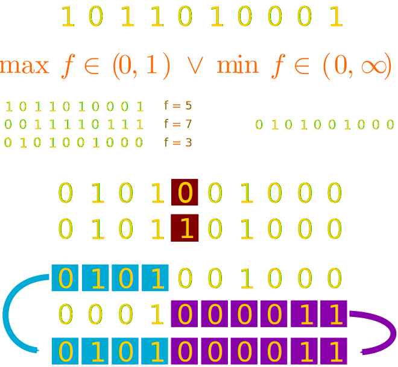
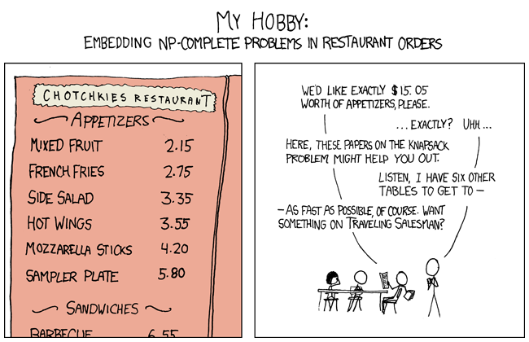
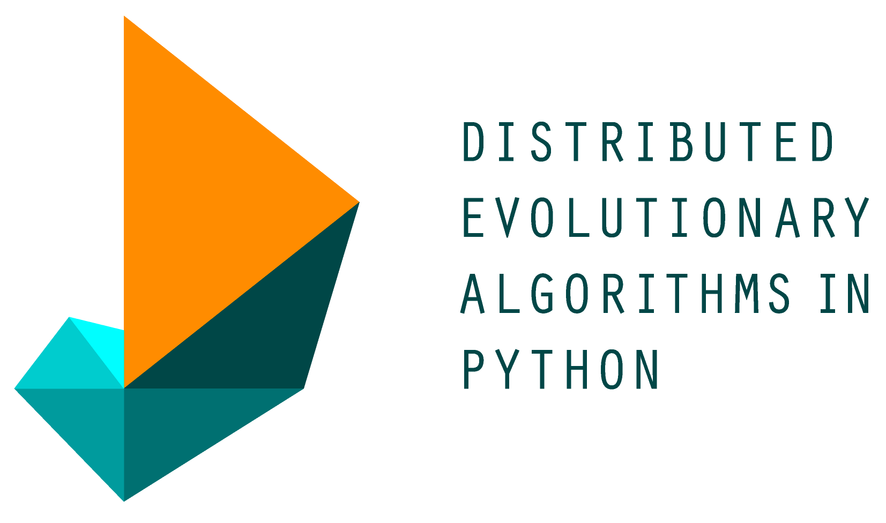

% Evolutionary Algorithms The Python Tutorial
% Paweł Widera
% 2015-10-14

## Tutorial organisation

No need to type, just **download code** and play with it :) 
Links are on the **slides**, follow them here:

<h1>
<http://tinyurl.com/pyne-evoalg>
</h1>

Don't afraid to **ask questions**!

The **dojo** part will be about using evolutionary algorithms to
solve a **real life** problem.

# Introduction

## Question

   
<figure></figure>

## Simple problems

**$[3, -1, 4, -5, 1, 3, 2]$**

smallest number  
substring of length 3 with minimum sum  
substring of maximum sum

~~~ {.python}
""""""""""""""""""""""""""""""""""""""""""""""""""""""""""""
                O(N)         O(N^2)         O(N^3)
""""""""""""""""""""""""""""""""""""""""""""""""""""""""""""
      1          6 sec       36 sec        3.5 min
     10         60 sec       60 min         60 hours
    100         10 min      100 hours      6.7 years
   1000        100 min        1 year       6.8 millenias
  10000       17 hours      114 years      6.8 million years
~~~

## Hard problems

**$[3, 1, 2, 6, 4, 5, 7]$** --- order at a dinner table

**$[D, A, V, I, N, C, I]$** --- combination opening a lock

~~~ {.python}
"""""""""""""""""""""""""""""""""""""""""""""
               O(N!)       O(k^N)
"""""""""""""""""""""""""""""""""""""""""""""
     1         1 sec       10 sec
     5         2 min       27 hours
    10        42 days     317 years
    20       5.6 AotU     230 AotU
~~~

## Evolution

- **population** of solutions
- solution **fitness**
- **selection** pressure
-  
- **reproduction**
-  
- **recombination**
-  

# Searching for solution

## Exhaustive search

<a href="../code/exhaustive_search-1.py">code</a>

~~~ {.python}
from __future__ import print_function

import string
import itertools

TARGET = "CHARLES DARWIN"
CHARACTERS = string.ascii_uppercase + " "

for candidate in itertools.product(CHARACTERS, repeat=len(TARGET)):
	candidate = "".join(candidate)
	print(candidate, end="\r")

	if candidate == TARGET:
		break
~~~

## Evaluation of exhaustive search

<a href="../code/exhaustive_search-2.py">code</a>

~~~ {.python}
best = len(TARGET)

for candidate in itertools.product(CHARACTERS, repeat=len(TARGET)):
	distance = evaluate(candidate)
	if distance < best:
		best = distance
		print("{0:02} {1}".format(distance, "".join(candidate)))

def evaluate(solution):
	return sum(1 for s,t in zip(solution, TARGET) if s != t)
~~~

. . .

~~~ {.python}
# C-style distance calculation
def evaluate(solution):
	distance = 0

	for i in range(len(TARGET)):
		if solution[i] != TARGET[i]:
			distance += 1

	return distance
~~~

## Random search

<a href="../code/random_search.py">code</a>

~~~ {.python}
best = len(TARGET)

while(True):
	candidate = [random.choice(CHARACTERS) for i in range(len(TARGET))]
	distance = evaluate(candidate)

	if distance < best:
		best = distance
		print("{0:02} {1}".format(distance, "".join(candidate)))
~~~

## Selection

<a href="../code/selection.py">code</a>

~~~ {.python}
best = [random.choice(CHARACTERS) for i in range(len(TARGET))]
fitness = evaluate(best)

for i in range(1000000):
	candidate = best[:]

	k = random.randrange(0, len(TARGET))
	candidate[k] = random.choice(CHARACTERS)

	distance = evaluate(candidate)

	print("[{0: 4}] {1:02} {2}".format(i, distance, "".join(candidate)), end="\r")

	if distance < fitness:
		fitness = distance
		best = candidate

	if fitness == 0:
		print()
		break
~~~

## Mutation

<a href="../code/mutation.py">code</a>

~~~ {.python}
MUTATION_CHANCE = 0.1

def mutate(solution):
	f = lambda x: random.choice(CHARACTERS) if random.random() < MUTATION_CHANCE else x
	return [f(x) for x in solution]

...

for i in range(1000000):
	candidate = mutate(best)
	distance = evaluate(candidate)

	...
~~~

## Population

<a href="../code/population.py">code</a>

~~~ {.python}
GENERATIONS = 50
POPULATION_SIZE = 100
MUTATION_PROBABILITY = 0.9

population = [init() for i in range(POPULATION_SIZE)]
fitnesses = [evaluate(individual) for individual in population]

def init():
	return [random.choice(CHARACTERS) for i in range(len(TARGET))]
~~~

. . .

~~~ {.python}
for i in range(GENERATIONS):
	population = variate(population)
	fitnesses = [evaluate(individual) for individual in population]

def variate(population):
	for i in range(len(population)):
		if random.random() < MUTATION_PROBABILITY:
			population[i] = mutate(population[i])
	return population
~~~

. . .

~~~ {.python}
fitnesses.sort()
params = fitnesses[0], fitnesses[-1], fitnesses[POPULATION_SIZE / 2]
print("best={0}, worst={1}, median={2}".format(*params))
~~~

## Tournament selection

<a href="../code/tournament-1.py">code</a>

~~~ {.python}
for i in range(GENERATIONS):
	chosen = select(population, len(population), TOURNAMENT_SIZE)
	population = variate(chosen)

def select(population, k, tournament_size):
	chosen = []
	for i in range(k):
		candidates = random.sample(population, tournament_size)
		chosen.append(min(candidates))
	return chosen
~~~

## Tournament selection - fixing bugs

<a href="../code/tournament-2.py">code</a>

~~~ {.python}
from collections import namedtuple

Individual = namedtuple("Individual", "solution, fitness")

def init():
	solution = [random.choice(CHARACTERS) for i in range(len(TARGET))]
	return Individual(solution, evaluate(solution))
~~~

. . .

~~~ {.python}
from copy import deepcopy
from operator import attrgetter

def select(population, k, tournament_size):
	chosen = []
	for i in range(k):
		candidates = random.sample(population, tournament_size)
		winner = min(candidates, key=attrgetter("fitness"))  # pick by fitness
		chosen.append(deepcopy(winner))  # append a copy, not a reference
	return chosen
~~~

. . .

~~~ {.python}
for i in range(len(population)):
	new_fitness = evaluate(population[i].solution)
	population[i] = population[i]._replace(fitness=new_fitness)
~~~

## Recombination

<a href="../code/recombination.py">code</a>

~~~ {.python}
def variate(population):
	for i in range(1, len(population), 2):
		if random.random() < CROSSOVER_PROBABILITY:
			crossover(population[i-1].solution, population[i].solution)

	...

def crossover(a, b):
	"""
	One point crossover: AAA|BBBBBBB, BBB|AAAAAAA.

	"""
	point = random.randrange(1, min(len(a), len(b)))
	a[point:], b[point:] = b[point:], a[point:]
~~~

. . .

~~~ {.python}
def crossover_uniform(a, b, probability=0.5):
	"""
	Uniform crossover: AAABBABBABB, BBBAABAABAA.

	"""
	size = min(len(a), len(b))
	for i in range(size):
		if random.random() < probability:
			a[i], b[i] = b[i], a[i]
~~~

# **Dojo** time!

## Code dojo

<figure></figure>

	http://xkcd.com/287/

## How to start?

~~~ {.python}
ITEMS_NAME = [
	"Mixed Fruit", "French Fries", "Side Salad",
	"Hot Wings", "Mozzarella Sticks", "Sampler Plate"
]
ITEMS_PRICE = [2.15, 2.75, 3.35, 3.55, 4.2, 5.8]

solution = selection of items

def init():
	return selection of 3 random items

def evaluate(solution, target_price):
	return abs(price_of_selected_items - target_price)

def mutate(solution):
	if random.random() > 0.5:
		solution.add(random_item)
	else:
		solution.subtract(random_item)

crossover = uniform_crossover
~~~

## Recommended software

- **DEAP** - Distributed Evolutionary Algorithms in Python   [http://deap.readthedocs.org/](http://deap.readthedocs.org/)

<figure></figure>
