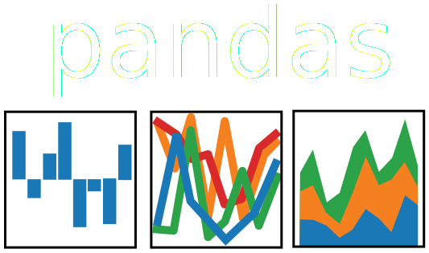

% Hacking the city open datawith pandas, Seaborn and Folium
% Paweł Widera, Rowan Hargreaves
% 2016-04-13

## What is this about?

- **reading** and **writing** data
- quick interactive data **exploration**
- basic data **manipulation**
-  
- advanced **transformations**
- multi-factor data **visualisation**
- geolocation **mapping**

  

## Our toolbelt

- **pandas** (data analysis) <small>v.0.17+</small>  <http://pandas.pydata.org/>
- **Seaborn** (visualization) <small>v.0.6+</small>  <http://stanford.edu/~mwaskom/software/seaborn/>
- **Folium** (mapping) <small>v.0.2+</small>  <https://folium.readthedocs.org/>

~~~ {.python}
pip install pandas
pip install seaborn
pip install folium

pip install numexpr
~~~

## Tutorial organisation

**Copy** fragments of **code** from slides to python console/IPython 
or **download** complete _code_ using link at a **slide corner**.

<h1>
<http://tinyurl.com/pyne-data-hacking>
</h1>

Please **ask** lots of **questions**!

After the introductory part, 
we will run a **freestyle** data hacking session.

## Let's get some data!

**OPEN DATA**  
information available for anyone to use, for any purpose, at no cost

<h1>
<http://tinyurl.com/ncl-datasets>
</h1>

- cycle parking, toilets, funerals, planning applications,
- library usage/stock/running costs, licenced premises,
- **payments over £250**, procurement transactions

# Basic data operations

## Reading and writing

~~~ {.python}
import pandas

# read CVS file to a data frame
data = pandas.read_csv("payments.csv")

# write data frame to a CSV file
data.to_csv("payments.csv")
~~~

JSON, HDF5, LaTeX, HTML, SQL db, Excel,
SAS <small>(.xpt)</small>, Stata <small>(.dta)</small>, ...

. . .

~~~ {.python}
import pandas

data = pandas.read_csv("january_2016.csv")
data.info()
~~~

## Reading real-world data

<a href="../code/read.py">code</a>

~~~ {.python}
# skip first two rows
data = pandas.read_csv("january_2016.csv", skiprows=2)
data.info()
~~~

. . .

~~~ {.python}
# number with a thousands separator
data = pandas.read_csv("january_2016.csv", skiprows=2, thousands=",")
data.info()

# replace spaces in column names with underscores
data.columns = data.columns.str.replace(" ", "_")
~~~

. . .

~~~ {.python}
# show the values in dates column
data["Paid_Date"].unique()

# convert strings to date (DD/MM/YYYY)
data["Paid_Date"] = pandas.to_datetime(data["Paid_Date"], format="%d/%m/%Y")
~~~

. . .

~~~ {.python}
# convert strings to date, set NaT for invalid/missing values
data["Paid_Date"] = pandas.to_datetime(data["Paid_Date"], format="%d/%m/%Y", errors="coerce")

data.info()
print(data.Paid_Date[0])

data = data.dropna()
~~~

## Interactive exploration

<a href="../code/explore.py">code</a>

~~~ {.python}
# show basic statistics for each numerical column
data.describe()

# show frequency
data["Directorate"].value_counts()

# show high value payments
data.query("Total > 1000000")

# complex queries
data.query("Group_Description == 'Revenue Income' and Total > 10000")
~~~

. . .

~~~ {.python}
# alternative syntax
data[(data.Group_Description == "Revenue Income") & (data.Total > 10000)]
~~~

## Selection

<a href="../code/select.py">code</a>

~~~ {.python}
# first 5 rows
data[:5]  # data.head()

# fifth row
data.ix[5]

# third column of the fifth row
data.ix[5, 3]
data.ix[5][3]
~~~

. . .

~~~ {.python}
# default index
data.index

# use date column as index
indexed_data = data.set_index("Paid_Date")
indexed_data.info()

# get all rows with given index
indexed_data.ix["2016-01-06"]
# get all rows with index in given range
indexed_data.ix["2016-01-12":"2016-01-14"]
~~~

## Aggregation

<a href="../code/aggregate.py">code</a>

~~~ {.python}
# group rows by one of the columns
grouped = data.groupby("Supplier_Name")

# all groups as a dictionary
grouped.groups

# single group
grouped.get_group("ROYAL MAIL")
~~~

. . .

~~~ {.python}
import numpy

# build-in functions
grouped.size()
grouped.first()

# custom functions
grouped.aggregate(numpy.sum)
grouped.Total.aggregate([numpy.mean, numpy.std])
~~~

. . .

~~~ {.python}
# modify members of the group
grouped.transform(lambda x: x.fillna(x.mean()))
~~~

## Transformation

<a href="../code/transform.py">code</a>

~~~ {.python}
# direct transformation
data.Total * 1000
# transformation with function
data.Total.apply(abs)
~~~

. . .

~~~ {.python}
import calendar
# add columns
data["week"] = data.Paid_Date.apply(lambda x: x.week)
data["day"] = data.Paid_Date.apply(lambda x: calendar.day_name[x.dayofweek])
# sum up payments for each day of week
weekdays = data.groupby([data.week, data.day]).sum()
# multi-level index!
weekdays.index
~~~

. . .

~~~ {.python}
# pivot inner level of the index to the column labels
weekdays.unstack()["Total"]
~~~

. . .

~~~ {.python}
# reshape into a new table
d = pandas.pivot_table(data, values="Total", index="Paid_Date", columns="Directorate")

# unpivot from wide format to long format
pandas.melt(d)

# pivot column labels to the inner level of the index
d.stack()
~~~

## Merging

<a href="../code/merge.py">code</a>

~~~
# read CVS file to a data frame
new_data = pandas.read_csv("february_2016.csv", skiprows=2, thousands=",")
# replace spaces in column names with underscores
new_data.columns = new_data.columns.str.replace(" ", "_")
# convert strings to date, set NaT for invalid/missing values
new_data.Paid_Date = pandas.to_datetime(new_data.Paid_Date, format="%d-%b-%y",
	errors="coerce")
# remove empty column
new_data = new_data.dropna(how="all", axis=1)
# remove all rows with missing values
new_data = new_data.dropna()

# concatenate the data frames, use new index
pandas.concat([data, new_data], ignore_index=True)
~~~

. . .

~~~ {.python}
# add rows
data.append(more_data)

# add columns
pandas.concat([data, more_data], axis=1)

# merge data on index
data.join(more_data, how="inner")

# merge data on specific attributes
pandas.merge(data, more_data, left_on="label", right_on="tag", how="outer")
~~~

# Visualisation

## Simple comparison

<a href="../code/comparison.py">code</a>

~~~ {.python}
import seaborn

seaborn.set_style("whitegrid")
seaborn.set_context("paper")

plot = seaborn.countplot(x="Directorate", data=data)
plot.figure.savefig("count_plot.pdf")
~~~

. . .

~~~ {.python}
# fix labels overlap, shrink margins
seaborn.plt.subplots(figsize=(8, 4))
plot = seaborn.countplot(x="Directorate", data=data)
plot.figure.savefig("count_plot_improved.pdf", bbox_inches="tight")
plot.figure.clear()
~~~

. . .

~~~ {.python}
# split into categories, plot bars horizontally
plot = seaborn.countplot(y="Directorate", hue="Cap/Rev", data=data)
plot.figure.savefig("count_plot_categories.pdf", bbox_inches="tight")
plot.figure.clear()
~~~

## Advanced comparison

<a href="../code/comparison2.py">code</a>

~~~ {.python}
# add extra columns
import calendar

data["week"] = data.Paid_Date.apply(lambda x: x.week)
data["day"] = data.Paid_Date.apply(lambda x: calendar.day_name[x.dayofweek])

# mean payment value for each day of week
plot = seaborn.barplot(x="day", y="Total", data=data)
plot.figure.savefig("bar_plot.pdf", bbox_inches="tight")
plot.figure.clear()
~~~

. . .

~~~ {.python}
# sum up payments for each day of week
weekdays = data.groupby([data.week, data.day]).sum()
# pivot inner level of the index to the column labels
new_data = weekdays.unstack()["Total"]

# draw a heatmap
plot = seaborn.heatmap(new_data, annot=True, fmt=".0f", linewidths=0.5)
plot.figure.savefig("heatmap.pdf", bbox_inches="tight")
plot.figure.clear()
~~~

. . .

~~~ {.python}
# specify order of columns
new_data = new_data[["Monday", "Tuesday", "Wednesday", "Thursday", "Friday"]]
~~~

## Distribution

<a href="../code/distribution.py">code</a>

~~~ {.python}
small_payments = data.query("0 < Total < 10000")

# histogram + kernel density estimation
plot = seaborn.distplot(small_payments.Total)
plot.figure.savefig("distribution.pdf", bbox_inches="tight")
plot.figure.clear()
~~~

. . .

~~~ {.python}
# box plot
plot = seaborn.boxplot(x="Total", y="Directorate", data=small_payments)
plot.figure.savefig("box_plot.pdf", bbox_inches="tight")
plot.figure.clear()
~~~

. . .

~~~ {.python}
# violin plot
plot = seaborn.violinplot(x="Total", y="Directorate", data=small_payments)
plot.figure.savefig("violin_plot.pdf", bbox_inches="tight")
plot.figure.clear()
~~~

## Multi-facet plots

<a href="../code/grid.py">code</a>

~~~ {.python}
small_payments = data.query("0 < Total < 10000")

# grid of distribution plots
grid = seaborn.FacetGrid(small_payments, col="Directorate", hue="Directorate",
	col_wrap=3, sharex=False, sharey=True)
grid.map(seaborn.distplot, "Total");

grid.set_titles("{col_name}")
grid.set(xlabel="", xlim=(0, 10000))

grid.savefig("grid_distribution.pdf", bbox_inches="tight")
grid.fig.clear()
~~~

. . .

~~~ {.python}
small_payments = small_payments.sort(["week", "day"])

# 2D grid of box plots
grid = seaborn.FacetGrid(small_payments, col="day", row="week",
	sharex=True, sharey=True)
grid.map(seaborn.boxplot, "Total", "Directorate")

grid.set_xlabels("")
grid.despine(left=True, bottom=True)

grid.savefig("grid_box_plot.pdf", bbox_inches="tight")
grid.fig.clear()
~~~

## Geolocation mapping

<a href="../code/geolocation.py">code</a>

~~~ {.python}
# read data from a CSV file
data = pandas.read_csv("libraries.csv")
~~~

. . .

~~~ {.python}
import folium

# find geometrical center
location = data.Latitude.mean(), data.Longitude.mean()

# draw a map using tiles from the Open Street Map project
osm = folium.Map(location, zoom_start=13)
osm.save("map.html")
~~~

. . .

~~~ {.python}
# mark libraries on the map, use name as the popup information
for info in zip(data.Latitude, data.Longitude, data.Library):
	folium.Marker(info[:2], popup=info[2]).add_to(osm)
osm.save("map.html")
~~~

. . .

~~~ {.python}
# mark libraries as circles with size proportional to number of computers
osm = folium.Map(location, zoom_start=15)
for info in zip(data.Latitude, data.Longitude, data.Library, data["No of PCs"]):
	folium.CircleMarker(info[:2], popup=info[2], radius=info[3],
		color="red", fill_color="green").add_to(osm)

osm.save("map_circles.html")
~~~

# Freestyle data hacking

## Bunch of ideas

- plot **numer of visits** in each **library** over time
- mark **bike racks** or public **toilets** on a **map**
- compare **weekly distribution** of **payments** in 6 months
