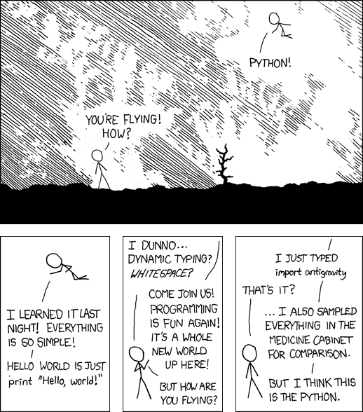

% Python on BBC micro:bitA game making session
% Paweł Widera
% 2016-08-18

## What's the plan?

- get to know the **BBC micro:bit**
- use the **radio** network
- make **2-player** games
- **contribute** advanced code

## BBC micro:bit

- 32-bit **ARMv6** Cortex M0 (**16MHz**)
- **16kB** RAM, **256kB** Flash
- Bluetooth 4.0 (low energy)
-  

. . .

**25 LED** matrix &nbsp; | &nbsp; Freescale MMA8652 3-axis **accelerometer**  
Freescale MAG3110 3-axis **magnetometer** (e-compass)  
push **button** x2 &nbsp; | &nbsp; **connectors** (USB, serial, PWM, GPIO, SPI, i2c, ...)

## MicroPython

<h1><http://micropython.org/></h1>

- subset of **Python 3** stdlib
- runs on **microcontrollers**
- funded through **Kickstarter**
- is a **free software**
-  
- fits into **256kB ROM**
- runs with **8kB RAM**
- has its own **pyboard**

 
<h4>Damien George</h4>

## Mu editor

<h1>
<http://codewith.mu/> 
<https://microbit-micropython.readthedocs.io/>
</h1>

- simple **code editor**
- aimed at 11-year old **kids**
-  
- multiplatform
- one button **flash**
- live coding (**REPL**)
- is a **free software**

 
<h4>Nicholas Tollervay</h4>

## First steps

~~~ {.python}
import antigravity

~~~

. . .

## Display

~~~ {.python}
from microbit import display

display.set_pixel(2, 2, 9)
~~~

. . .

~~~ {.python}
from microbit import Image

display.show(Image("90000:08000:00700:00060:00005"))
~~~
. . .

~~~ {.python}
display.show(Image.SNAKE)
~~~

. . .

~~~ {.python}
empty = Image(5, 5)
display.show([Image.HEART, empty], loop=True)
~~~

## Animation

~~~ {.python}
images = Image.ALL_CLOCKS
display.show(images, loop=True, delay=50, wait=False)
~~~

. . .

~~~ {.python}
image = Image.DUCK
animation = [image.shift_left(i) for i in range(-5, 5)]
display.show(animation, loop=True, delay=100)
~~~

. . .

~~~ {.python}
display.scroll("GAME OVER", loop=True)
~~~

## Buttons

~~~ {.python}
from microbit import button_a, button_b

while True:
	if button_a.is_pressed():
		display.show(Image.ARROW_W)
	elif button_b.is_pressed():
		display.show(Image.ARROW_E)
	else:
		display.clear()
~~~

. . .

~~~ {.python}
from microbit import sleep

sleep(5000)

if button_a.was_pressed():
	count = button_a.get_presses()
	print(count)
~~~

## Movement

~~~ {.python}
from microbit import accelerometer

while True:
	x = accelerometer.get_x()
	print("{0:>5}".format(x))
	sleep(100)
~~~

. . .

~~~ {.python}
while True:
	gesture = accelerometer.current_gesture()
	print(gesture)
	sleep(10)
~~~

## I/O

~~~ {.python}
from microbit import pin0

while True:
	if pin0.is_touched():
		display.show(Image.HAPPY)
	else:
		display.show(Image.SAD)
~~~

. . .

~~~ {.python}
from microbit import pin1, pin2

bit = pin1.read_digital()
pin2.write_digital(bit)
~~~

## Radio

~~~ {.python}
import radio

radio.on()

while True:
	message = radio.receive()
	if message:
		print(message)
		radio.send(message)
~~~

. . .

~~~ {.python}
radio.config(
	length = 32,  # 1-251
	queue = 3,
	channel = 7,  # 0-100
	group = 0     # 0-255
)
~~~

## Fireflies

~~~ {.python}
import radio
import random
from microbit import display, Image, button_a, sleep

steps = list(range(5, 9)) + list(range(9, -1, -1))
animation = [Image().invert() * (i/9) for i in steps]

radio.on()
while True:
	if button_a.was_pressed():
		radio.send("flash")

	message = radio.receive()
	if message == "flash":
		sleep(random.randint(50, 350))
		display.show(animation, delay=60, wait=False)

		if random.random() < 0.1:
			sleep(500)
			radio.send("flash")  # re-broadcast
~~~

# Let's make a game!

## Setup

<h1>
<http://codewith.mu/>  
<https://microbit-micropython.readthedocs.io/>
<http://cheat.microbit-playground.co.uk/>
<https://create.withcode.uk/python/8w>
</h1>

~~~ {.bash}
chmod +x mu

sudo usermod -a -G dialout username

mkdir ~/MICROBIT
sudo mount /dev/disk/by-uuid/2702-1974 ~/MICROBIT
~~~

## Some ideas <small>(ordered by difficulty)</small>

- rock/paper/scissors/lizard/spock
- gesture memory
- treasure hunt
- wild west shootout
- button mashing race
- battle ships

