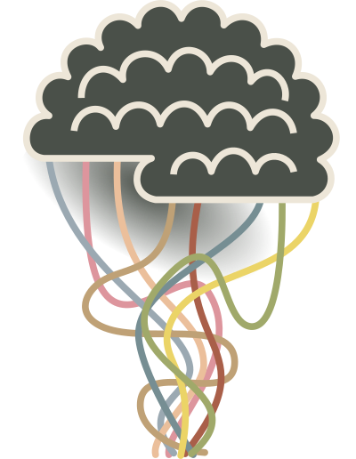
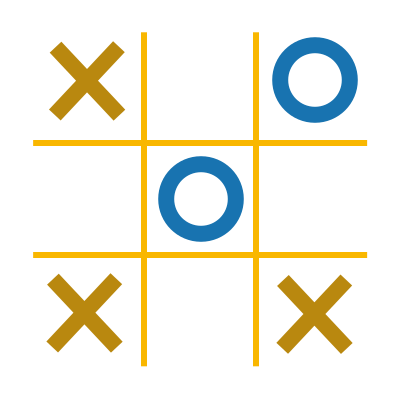
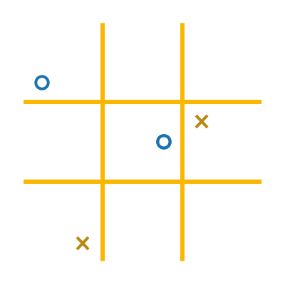
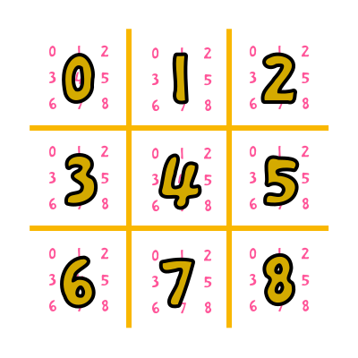

% Artificial Intelligence in gamesThe Python Tutorial
% Paweł Widera
% 2018-05-09

## What is this about?

- writing **AI** in Python
- learning about **adversarial search**
-  
- making an **AlphaGO**-like player
-  
- friendly **competition**

## Tutorial organisation

**Copy** fragments of **code** from slides to your editor 
or **download** complete _code_ using the link at a **slide corner**.

<h1>
<http://tinyurl.com/pyne-ai-games>
</h1>

 
Feel **free** to ask **questions** at any time!

**Experiment** with the code, make it yours.

## Setup

- **Python 3** (for our AI bots)
- **Java (JRE) 1.8** (for the game environment)
- <h1>[runner.jar][runner] <small>(9.9MB)</small>*</h1>

*<small>game engine adapted from the code published by</small> [CodinGame][cg]

. . .

~~~{.shell}
>$ java -jar runner.jar

Usage: java -jar runner.jar <bot1> <bot2> [-r]
~~~

. . .

~~~
for Firefox in about:config
"dom.moduleScripts.enabled" == True
~~~

# The Game

## Hints

- played in **Egypt** in year **8700** HE 
  <small>(see</small> [The Human Era][he] <small>Kurzgesagt video)</small>
-  
- run on the **EDSAC** computer 
  in Cambridge in year **11952** HE

<cite>CC-BY Computer Laboratory, University of Cambridge</cite>

## OXO

<video src="resources/oxo.webm"></video>

## Tic-tac-toe

<figure>
 
**m** x **n** board with **k** in a row to win
</figure>

## Ultimate Tic-tac-toe

<figure>
 
<small>Response time: **100ms** except 1st turn (**1s**)</small>
 
<https://www.theofekfoundation.org/games/UltimateTicTacToe/>
</figure>

## Input / Output

- **opponents** move
- number of **valid moves**
- **n** lines with moves
-  
- ~~~{.python}
-1 -1         0 2      
81            79       
0 0           0 0      
0 1           0 1      
0 2           0 3      
⋮            ⋮       
8 7           8 7      
8 8           8 8      
~~~
-  
- **our** move

 
`<board> <square>`

# Simple AI

## Let's make some moves

<a href="../code/first_bot.py">code</a>

~~~{.python}
while True:
	board, square = [int(x) for x in input().split()]

	count = int(input())

	moves = []
	for i in range(count):
		board, square = [int(x) for x in input().split()]
		moves.append((board, square))

	move = moves[0]
	print(move[0], move[1])
~~~

. . .

 
AI system is an **intelligent agent** that can decide  
**what** actions to take and **when** to take them

. . .

~~~{.python}
	# debugging
	import sys
	print(x, file=sys.sdterr)
~~~

## Move lottery

<a href="../code/random_bot.py">code</a>

~~~{.python}
Move = namedtuple("Move", "board square")

def read_move():
	return Move(*map(int, input().split()))

def write_move(move):
	print(move.board, move.square)
~~~

. . .

~~~{.python}
while True:
	enemy_move = read_move()

	count = int(input())
	moves = [read_move() for i in range(count)]

	write_move(random.choice(moves))
~~~

## Move evaluation

<a href="../code/heuristic.py">code</a>

~~~{.python}
CORNERS = {0, 2, 6, 8}
CENTRE = 4

def evaluate(move):
	if move.square in CORNERS:
		return 2
	if move.square == CENTRE:
		return 1
	return 0
~~~

. . .

~~~{.python}
while True:

	...

	move = max(moves, key=evaluate)
	write_move(move)
~~~

## State evaluation

<a href="../code/heuristic-2.py">code</a>

~~~{.python}
boards = tuple([0 for i in range(9)] for i in range(9))

while True:
	# place opponents move
	enemy_move = read_move()
	if enemy_move.board >= 0:
		boards[enemy_move.board][enemy_move.square] = -1

	...

	# place my move
	boards[move.board][move.square] = 1
~~~

. . .

~~~{.python}
DIAGONALS = ((0, 4, 8), (2, 4, 6))
COLUMNS = ((0, 3, 6), (1, 4, 7), (2, 5, 8))
ROWS = ((0, 1, 2), (3, 4, 5), (6, 7, 8))
LINES = ROWS + COLUMNS + DIAGONALS

def evaluate(move):
	current = boards[move.board].copy()
	current[move.square] = 1

	if any(sum(current[x] for x in line) == 3 for line in LINES):
		return 10

	...
~~~

## Game ending

<a href="../code/heuristic-3.py">code</a>

~~~{.python}
State = namedtuple("State", "meta boards")

...

meta = [0 for i in range(9)]
boards = tuple([0 for i in range(9)] for i in range(9))
state = State(meta, boards)
~~~

. . .

~~~{.python}
def has_line(board, player=1):
	return any(sum(board[x] for x in line) == player * 3 for line in LINES)

def update(state, move, player):
	current = state.boards[move.board]
	current[move.square] = player
	if has_line(current, player):
		state.meta[move.board] = player
	return current
~~~

. . .

~~~{.python}
def evaluate(move):
	new_state = deepcopy(state)
	new_board = update(new_state, move, 1)

	if has_line(new_state.meta):
		return 100
	if has_line(new_board):
		return 10
	return 0
~~~

## Not helping the opponent...

<a href="../code/heuristic-4.py">code</a>

~~~{.python}
def under_threat(board):
	return any(sum(board[x] for x in line) == -2 for line in LINES)

def evaluate(move):

	...

	next_board = new_state.boards[move.square]
	if under_threat(next_board):
		return -10

	...
~~~

. . .

~~~{.python}

def evaluate(move):

	...

	new_state.meta[move.square] = -1
	if has_line(new_state.meta, -1) and under_threat(next_board):
		return -100

	...
~~~

# Forward thinking

## Minimax algorithm

~~~{.python}
def best_enemy_play(move):
	new_state = deepcopy(state)
	update(new_state, move)

	best = -1000
	for enemy_move in valid_moves(new_state, move.square):
		best = max(best, evaluate(new_state, enemy_move, -1))
	return best

...

	# choose best move
	move = min(moves, key=best_enemy_play)
~~~

. . .

~~~{.python}
def game_over(meta):
	return any(abs(sum(meta[x] for x in line)) == 3 for line in LINES)

def valid_moves(state, next_board):
	if game_over(state.meta):
		return []

	# next board is playable (not captured and not full)
	if (state.meta[next_board] == 0 and not all(state.boards[next_board])):
		return (Move(next_board, x) for x in range(9) if state.boards[next_board][x] == 0)

	# cannot play on the next board, list valid moves on all other boards
	boards = (x for x in range(9) if state.meta[x] == 0)
	return (Move(b, x) for b in boards for x in range(9) if state.boards[b][x] == 0)
~~~

## Minimax evaluation

<a href="../code/minimax.py">code</a>

~~~{.python}
def evaluate(state, move, player):
	new_state = deepcopy(state)
	new_board = update(new_state, move, player)
	next_board = new_state.boards[move.square]

	if has_line(new_state.meta, player):
		return 100

	new_state.meta[move.square] = -player
	if has_line(new_state.meta, -player) and under_threat(next_board, -player):
		return -100

	if has_line(new_board, player):
		return 10

	if under_threat(next_board, -player):
		return -10

	if under_threat(new_state.meta, player):
		return 5

	# free grid choice for the opponent
	if new_state.meta[move.square] != 0:
		return -5

	return 0
~~~

# Guessing the future

## Monte Carlo tree search

<a href="../code/mcts.py">code</a>

~~~{.python}
def best_play(moves, start_time):
	scores = [0] * len(moves)
	for i, move in itertools.cycle(enumerate(moves)):
		# stop when running out of time
		if (time.perf_counter() - start_time) > 0.097:
			break
		# best score at the end of a random play is the move score
		scores[i] = max(scores[i], random_play(move))

	best_index = max(range(len(moves)), key=lambda x: scores[x])
	return moves[best_index]
~~~

. . .

~~~{.python}
def random_play(move):
	new_state = deepcopy(state)
	player = 1

	for i in range(0, DEPTH):
		update(new_state, move, player)
		if game_over(new_state.meta):
			return player * 100

		next_moves = list(valid_moves(new_state, move.square))
		move = random.choice(next_moves)
		player = -1 * player

	return evaluate(new_state, move, 1)
~~~

# Tournament

## Rules

- **just play** the game, **no hacks** please
- **your code** will be visible to **other teams**

<h1>
<http://192.168.4.207:8800/>
</h1>

  
Other options: <small>**USB stick**</small> or <https://send.firefox.com>

[runner]: ../runner.jar
[cg]: https://github.com/CodinGame/game-tictactoe
[he]: https://www.youtube.com/watch?v=czgOWmtGVGs
